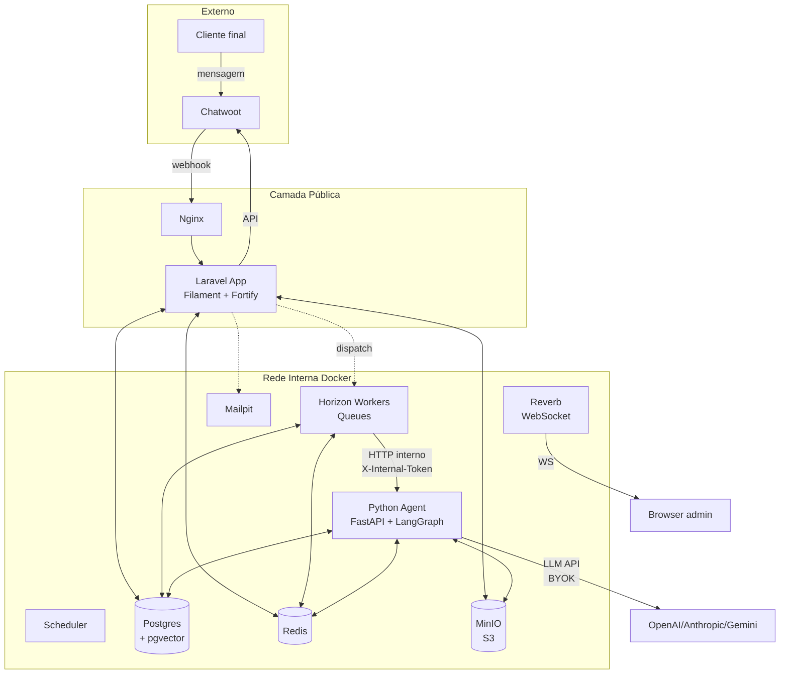
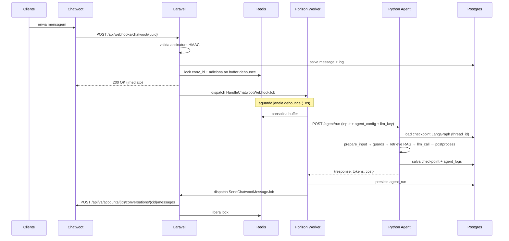

# Arquitetura Oryntra

## Visão de alto nível

## Fluxo de mensagem (request lifecycle)

## Separação Laravel ↔ Python

| Responsabilidade | Laravel | Python |
|---|---|---|
| Painel admin (CRUD) | ✅ Filament | ❌ |
| Auth + tenancy | ✅ Fortify + Shield | ❌ |
| Webhook receiver | ✅ | ❌ |
| Queue orchestration | ✅ Horizon | ❌ |
| Debounce + locks | ✅ Redis | ❌ |
| Send msg Chatwoot | ✅ via API | ❌ |
| Sync Chatwoot accounts | ✅ Platform API | ❌ |
| LangGraph runtime | ❌ | ✅ |
| LLM calls | ❌ | ✅ (BYOK) |
| Embeddings | ❌ | ✅ |
| RAG search | ❌ | ✅ |
| Document parsing | ❌ | ✅ |
| Audio transcription | ❌ | ✅ |
| Image vision | ❌ | ✅ |
| Checkpoints LangGraph | ❌ | ✅ (escreve em Postgres) |
| Memória estruturada | ✅ tabelas + jobs | leitura via tool |
| Memória semântica (RAG) | ❌ | ✅ pgvector |

## Comunicação Laravel ↔ Python

- Protocolo: HTTP/1.1 interno (Docker network `oryntra-net`)
- Endpoint: `http://agent-python:8000`
- Auth: header `X-Internal-Token: $INTERNAL_API_TOKEN`
- Timeout: 60s (LLM pode demorar)
- Retry: Horizon faz retry no job, Python idempotente via `agent_run_id`

## Estratégia de checkpoints LangGraph

- Lib: `langgraph-checkpoint-postgres`
- Tabela: `langgraph_checkpoints` (gerenciada pela lib)
- `thread_id`: `workspace:{ws_id}:account:{account_id}:conversation:{conv_id}`
- Permite HITL (Fase 6): pausa execução, retoma após aprovação humana

## Multi-tenancy

- Toda tabela de negócio tem `workspace_id` + índice composto
- Filament tenancy automatiza scope nas Resources
- Jobs/services manuais precisam usar `Workspace::scope()` ou filtrar manualmente
- RAG search no Python filtra `workspace_id` na query pgvector
- LangGraph checkpoints incluem `workspace_id` no `thread_id`

## Escalabilidade

| Componente | Estratégia |
|---|---|
| Laravel app | Horizontal: várias instâncias atrás de load balancer |
| Horizon workers | Horizontal: aumentar supervisors por fila pesada |
| Python agent | Horizontal: stateless, escala com volume de runs |
| Postgres | Vertical inicial; sharding por workspace só em escala extrema |
| Redis | Sentinel/Cluster em escala alta |
| MinIO | Distributed em produção real |

## Observabilidade

- **Pail** (terminal): tail de logs em dev
- **Telescope** (web): debug detalhado de requests/queries/jobs em dev (off em prod)
- **Horizon** (web): dashboard de queues
- **Reverb logs**: WebSocket connections
- **agent_runs / agent_logs**: trace por execução visível no Filament
- Adiar: Pulse, Sentry, Langfuse (avaliar quando houver volume real)
